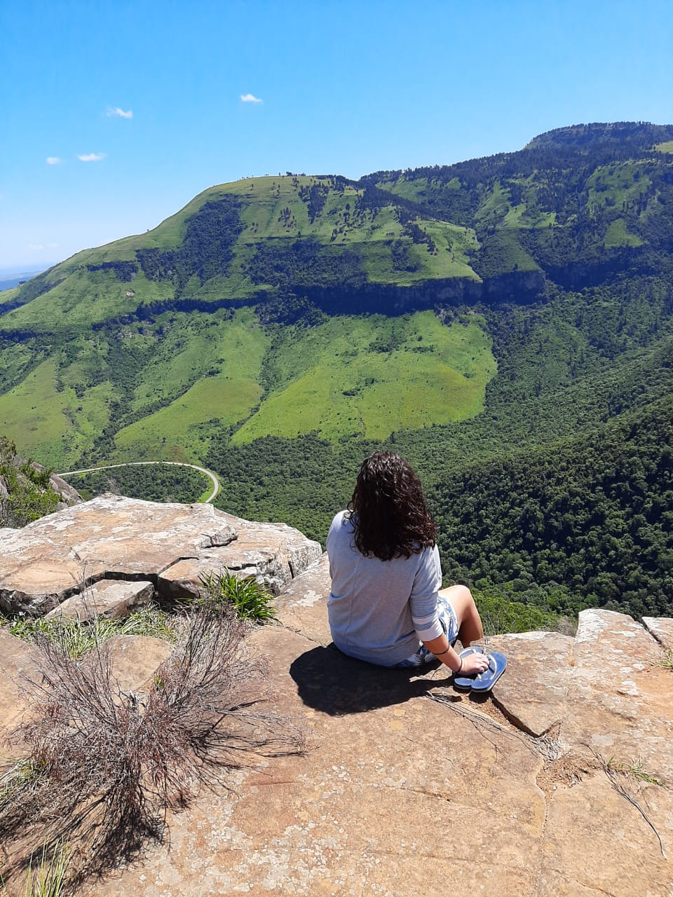

```{r setup, include=FALSE}
knitr::opts_chunk$set(echo = FALSE)
```

Hi!

Welcome to my blog. I described this post as introducing myself.

Who am I? In a bid to stop defining myself by my work, maybe I could say that I am a nature lover who does not get out nearly enough; I like to occupy my time learning new things, listening to audiobooks (I'm on an Enderverse binge at the moment), and looking after my indoor plants. If I did have to mention work, I'd say that I am a researcher and teacher. I've studied Linguistics, but my research currently fits more closely in the sub-discipline of Applied Linguistics. 

I am hoping that this website will be a place for me to keep a record of what I've done and what I'm interested in. After getting a little more used to R I wanted to see if I would be able to make a website (and keep it running). Since I'm always having to Google the same things when it comes to my own analysis, I hope to also set up some posts to remind myself how to do things. Maybe this could be useful to you too.

Anyway, please get in touch if you'd like to say "hi!". The relevant contacts are available on the home page. 

{width=50%}