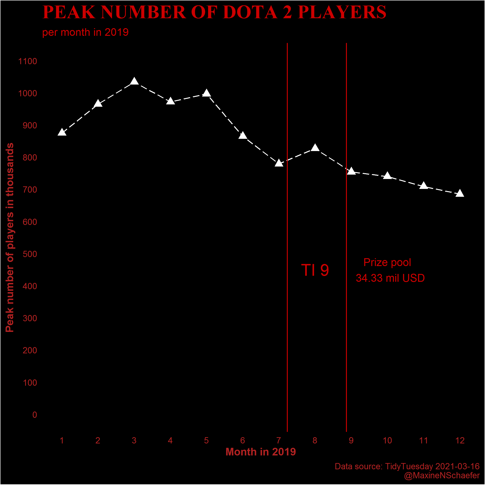

```{r setup, include=FALSE}
knitr::opts_chunk$set(echo = TRUE)
```

I recently attended a guided TidyTuesday hosted by RLadies Freiburg and wanted to apply what I had learned to a new data set. I went to the TidyTuesday Github repo. Once there I found the [Video Games and Sliced]((https://github.com/rfordatascience/tidytuesday/tree/master/data/2021/2021-03-16)) dataset. This dataset looked interesting to me because (1) it was about gaming which is a topic often spoken about in my household, and (2) it was a relatively small dataset containing only seven variables. 

In this post, I'll first give a narrative summary of what I did. I include all the code and the final visualisation at the end of the post. You can find all the code at the [TidyTuesday repo on Github](https://github.com/MaxineNSchaefer/tidytuesday).

First, load packages with `library()`. I loaded `{tidyverse}` and `{tidytuesdayR}`. I downloaded the data from Github using `{tidytuesdayR}` as indicated in the repo that contains the data. I soon realised you cannot keep downloading the data from online so I saved the data to a .csv file.

I next peaked at the data using `View()`. This function shows you the data in the dataviewer. However, one also needs to summarise the data to see what one is working with. I used `skim()` from `{skimr}` for this overview. I also noted the data type of each variable.

I decided to focus on Dota 2 because this is a game my husband loves to play. I also wanted to look at the peak number of players per month and how this changed over a year. I decided on 2019 since it was the last 'normal' year, and because I remember having the chance to open some of the prizes in my husband's Battle Pass before The International. For those who don't know, The International is the main and largest competition of the Dota 2 season each year. Thus, for my visualisation I added some data on the start and end dates of TI, and included the value of the total prize pool. 

**What did I find? Peak player numbers do go up during TI, but do not reach the peak number of players in March.**



In keeping with the Dota 2 'feel' I made the visualisation dark. I even asked my husband, Mark, for some tips to make it feel more like Dota 2. We ended up with red as the colour. I am not sure I am in love with it, but I'm still proud of my first TidyTuesday attempt. 

Here's the code to make the plot.

```{r message = FALSE, eval = FALSE}
# libraries
library(tidytuesdayR) # only to initially download data
library(tidyverse)
library(ggdark) # for dark minimal theme

# Download and save data
tuesdata <- tidytuesdayR::tt_load('2021-03-16')
dat <- tuesdata$games

# Check out the data
View(dat)
skimr::skim(dat)

# TI start and end
TIstart <- (7/30) + 7 # TI starts 7 of July, convert the 7th day into a decimal and add to 7th month
TIend <- (26/30) + 8 # TI ends 26 Aug, convert the 26th day into a decimal and add to 8th month

# Generate graph

p_final <- 
  
  # get data ready
 dat %>% 
  
  # filter data to include only Dota 2 for 2019
  filter(gamename == "Dota 2", # keep only Dota 2
         year == 2019) %>%     # keep only year 2019
  
  # make axis more readable
  mutate(peak_in_thousands = round((peak/1000), 0 )) %>% # reduce numbers on the graph by dividing by 1000
  
  # convert months to numbers so that the months are listed in order in the graph
  mutate(month = case_when(   
    month == "January" ~ 1,
    month == "February" ~ 2,
    month == "March" ~ 3,
    month == "April" ~ 4,
    month == "May" ~ 5,
    month == "June" ~ 6,
    month == "July" ~ 7,
    month == "August" ~ 8,
    month == "September" ~ 9,
    month == "October" ~ 10,
    month == "November" ~ 11,
    month == "December" ~ 12
  )) %>% mutate(month = as.numeric(month)) %>%  # convert to numeric so that the months will be listed in order


# base graph
 ggplot(aes(x = month, y = peak_in_thousands)) + 
  geom_point(shape = 17, size = 3) + # add points
  geom_line(linetype = 5) + # add lines to join points
  
  # add labels
  labs(x = "Month in 2019",  
       y = "Peak number of players in thousands",
       title = "PEAK NUMBER OF DOTA 2 PLAYERS",
       subtitle = "per month in 2019", 
       caption = "Data source: TidyTuesday 2021-03-16
       @MaxineNSchaefer") +
  
  # fix axis breaks and limits
  scale_x_continuous(n.breaks = 12) + # have a break for each month
  scale_y_continuous(limits = c(0, 1100), breaks = c(0, 100, 200, 300, 400, 500, 600, 700, 800, 900, 1000, 1100)) + # start at 0
  
  # add start and end dates of The International which I got from https://liquipedia.net/dota2/The_International/2019#Viewership_Stats
  geom_vline(xintercept = TIstart, color = "#cc0000") + # add start date and color using Dota 2 colour
  geom_vline(xintercept = TIend, color = "#cc0000") + # add end date and color using Dota 2 colour
  
    # add label for TI, and prize pool
  annotate(geom="text", x=8, y=450, label="TI 9", color="#cc0000", size = 6) + # add text to graph 
  annotate(geom="text", x=10, y=450, label= # add text to indicate prize pool value
  "Prize pool
  34.33 mil USD", color="#cc0000", size = 4) +
  
  # edit theme
dark_theme_minimal() + # add basic dark theme from {ggdark}
  
  # edit theme to match Dota 2 colours more or less
  theme(axis.title = element_text(colour = "#b22222", face = "bold"),
        plot.title = element_text(size = 20, colour = "#cc0000", face = "bold", family = "serif"), #change the font for the title
        plot.subtitle = element_text(colour = "#cc0000"),
        plot.caption = element_text(colour = "#b22222"),
        axis.text = element_text(colour = "#b22222"),
        panel.grid.major = element_blank(), # remove grid lines
        panel.grid.minor = element_blank())  # remove grid lines

p_final
# ggsave("final_plot.png")