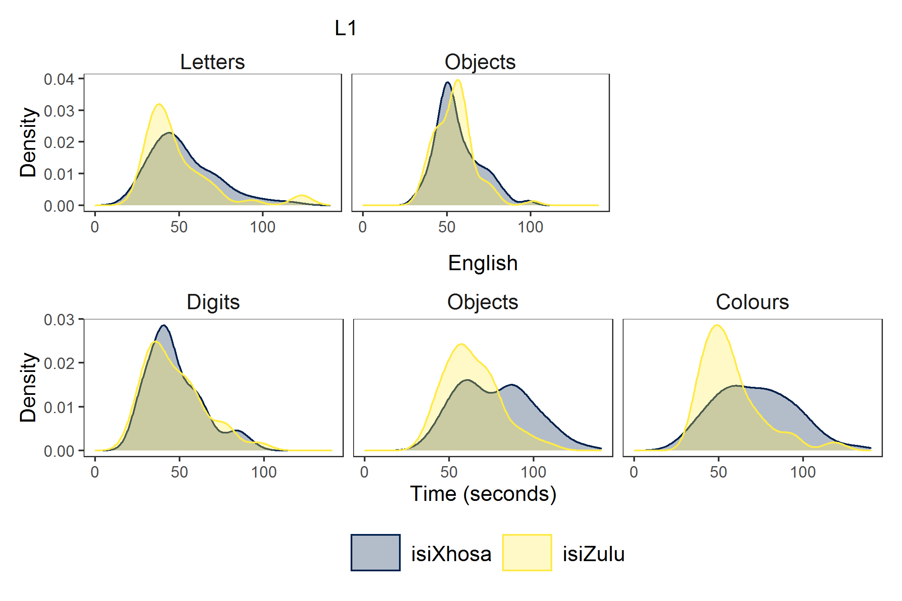

```{r setup, include=FALSE}
knitr::opts_chunk$set(echo = TRUE)
```

# Introduction

I am working on the descriptive statistics section of the Grade 1 sample of my PhD. I thought I'd share how I used `{patchwork}` for one of the plots, using simulated data based on my PhD data.

Recently I have become interested in data simulation, especially since I, unfortunately, did not know about open science until I had already asked for informed consent from my participants' guardians. I cannot share the data from my PhD, but I can share simulated data from it. I recently attended some sessions of the very useful [Psychology Postgraduate Affairs Group (PsyPAG)](http://www.psypag.co.uk/) & MSCP-Section Simulation Summer School ([resources here](https://simsummerschool.github.io/)) where I picked up tips on simulating data for linear models and linear fixed effects models. It was a lot to take in, so in this post, I only apply what I learned about simulating a dataset from [Andrew Hales' session on 9 June 2021](https://www.youtube.com/watch?v=x2hhc5KYw-c).

I also need to give a special shout out to the wonderful people who put all the answers to my frequently searched `{ggplot2}` questions in one neat tutorial. If you're like me please go, RIGHT NOW, and bookmark this [Intro to Data Viz tutorial](https://psyteachr.github.io/introdataviz/) from PsyTeachR. I learned about `{patchwork}` from that tutorial. 

Alright, now for the task at hand. In this blog, I  simulate rapid automatised naming (RAN) data based on the results of participants in my PhD then present a density plot of the distribution of scores for different tasks (letters, digits, colours and objects) per language group (isiXhosa and isiZulu) and per language of administration (first language and English). 

## Set up 

Load packages. 

```{r message = FALSE}
library(tidyverse)
library(patchwork)
library(jtools)
```

## Simulate data (with some context)

Since I did not ask for permission to share the data from my PhD, I need to simulate the data based on the summary statistics from my Grade 1 sample. I suppose a summary of what I am doing is needed. 

I am examining how phonological processing skills (phonological awareness, rapid automatised naming and phonological working memory) develop over time and contribute to literacy development in children's first language (L1; isiXhosa or isiZulu) and additional language (English). I collected data from isiXhosa-English and isiZulu-English emergent bilingual children who attended schools where the medium of instruction matched their first language. All constructs where measured with more than one task in both L1 and English. For the blog at hand, I refer only to the distribution of scores for the rapid automatised naming (RAN) task. 

A RAN task requires a participant to name a set of six items (either digits, letters, colours or objects) in an array of 9 by 4 as fast as they can. The final score is the total number of seconds taken to name all items. RAN is a predictor of reading fluency.

For the data simulation, I simulated data for `id`, `language`, and the different RAN tasks (digits, letters, objects, colours). Because of educational practices, and based on the pilot study, RAN letters was only administered in L1, and RAN colours and RAN digits was only administered in English. I used the mean and standard deviations from these tasks to simulate data for this blog. I simulated the data separately for each language group in the study and then combined the datasets using `rbind()`.

```{r}
sample_size <- 70 # set sample size (this number differs from my PhD)

set.seed(1405)    # set seed for reprodicibility

# simulate data for group 1 (in wide format)
xhosa <- data.frame(
   "id" = rep(1:sample_size),   # give the participants unique IDs
   "language" = "isiXhosa",        # assign participants to isiXhosa group
   
   #simulate data based on summary stats from my project
   "L1_ran_let_time" = rnorm(n = sample_size, mean = 53, sd = 20),
   "L1_ran_obj_time" = rnorm(n = sample_size, mean = 56, sd = 13),
   "English_ran_dig_time" = rnorm(n = sample_size, mean = 47, sd = 16),
   "English_ran_obj_time" = rnorm(n = sample_size, mean = 77, sd = 22),
   "English_ran_col_time" = rnorm(n = sample_size, mean = 71, sd = 23)
   )

# simulate data for group 2 (in wide format)
zulu <- data.frame(
   "id" = rep((sample_size +1):(sample_size*2)),   # give the participants unique IDs
   "language" = "isiZulu",                            # assign participants to isiZulu group
   
   #simulate data based on summary stats from my project
   "L1_ran_let_time" = rnorm(n = sample_size, mean = 49, sd = 22),
   "L1_ran_obj_time" = rnorm(n = sample_size, mean = 55, sd = 12),
   "English_ran_dig_time" = rnorm(n = sample_size, mean = 47, sd = 18),
   "English_ran_obj_time" = rnorm(n = sample_size, mean = 64, sd = 16),
   "English_ran_col_time" = rnorm(n = sample_size, mean = 57, sd = 18)
   )

# join datasets
sim_data <- rbind(xhosa, zulu)
```

The simulated data is in wide format. To create the graph I want, I need to convert the data to long form. The [PsyteachR tutorial](https://psyteachr.github.io/introdataviz/transforming-data.html) also explains how to do this, but I first learned how to do this from Emma James and colleagues' [open data](https://osf.io/96542/) for their 2021 paper on ["The relations between morphological awareness and reading comprehension in beginner readers to young adolescents"](https://doi.org/10.1111/1467-9817.12316). 

The code below shows how I use `pivot_longer()` to convert the data from wide to long format so that each observation occupies a row.

```{r}
sim_data_long <- sim_data %>% 
  pivot_longer(3:7, names_to = "task", values_to = "score") 
head(sim_data_long)
```

`task` still contains data for two variables: the language of the task and the task itself. I separate these values using `separate()` using the underscore in the task name, then I convert the character variables to factors to make it easier to plot. 

```{r}
sim_data_long <- sim_data %>% 
  pivot_longer(3:7, names_to = "task", values_to = "score") %>%   # change to long format
  separate(col = task, into = c("tasklang", "task"), sep = "_", extra = "merge") %>%  # separate language of administration from task
  mutate(across(c(language, tasklang,task), as_factor)) # change character variables into factors
         
```

## Visualisation

I want to show the distribution of the scores for **each task** for **each language group** and **each language of task administration**. Unfortunately, you can only really represent three variables at a time in one visualisation (well, anyway, I only know how to show three!). I decided to create two plots, one for each language of administration. 

To do this, I assigned one variable to `x` in ggplot (i.e. `score`), one variable to `fill` and `colour` (i.e. `language`), and one variable to `facet_wrap()` (i.e. `task`). I then filtered by language of task administration (i.e. `tasklang`) so that I would have one visualisation for L1 and one for English. Once I have both graphs, I group them together neatly using `{patchwork}`.

### Plot 1 - L1 task administration

Here, I filtered the data so that only the L1 data was included. I planned to have this plot at the top since it included fewer tasks than the English administration. 

```{r}
p1 <- sim_data_long %>%   
  filter(tasklang == "L1") %>%   # visualise data for L1 only
  
  # rename for neater graph
  mutate(
    task = case_when(
      task == "ran_col_time" ~ "Colours",
      task == "ran_dig_time" ~ "Digits",
      task == "ran_let_time" ~ "Letters",
      task == "ran_obj_time" ~ "Objects")) %>% 
  
  # add base plot
  ggplot(aes(x = score, # distribution of scores
             colour = language, fill = language)) + # colour and fill for each language group
  
  # density graph with colours
  geom_density(alpha = .3) +  # add density geom with alpha at .3 for easer view of each language group
  scale_colour_viridis_d(name = "Language", option = "E") +
  scale_fill_viridis_d(name = "Language", option = "E") +
  
  # add theme
  theme_apa()  +  # use APA theme from jtools
  theme(plot.title = element_text(size = 12, face = "plain", hjust = .5)) +  # specify size, face and position of title
  
  # edit axes
  labs(x = NULL, y = "Density", title = "L1") +  # no x axis label since we will add this plot to another one
  xlim(0, 150) +    # set x axis limits
  guides(fill = FALSE, color = FALSE) +  # hide the legend since it will be in the second graph
  
  facet_wrap(~task) # use facet_wrap so that each task has its own panel

p1 # print visualisation
```

### Plot 2 - English task adminstration

Here, I filtered the data so that only the English data was included.

```{r}
p2 <- sim_data_long %>% 
  
  filter(tasklang == "English") %>%  # use only English data
  
  # rename for neater graph
  mutate(task = case_when(
      task == "ran_col_time" ~ "Colours",
      task == "ran_dig_time" ~ "Digits",
      task == "ran_let_time" ~ "Letters",
      task == "ran_obj_time" ~ "Objects")) %>% 
  
  # base layer
  ggplot(aes(x = score, 
             colour = language, fill = language)) +
  
  # density graph with colours
  geom_density(alpha = .3) +
  scale_colour_viridis_d(name = "Language", option = "E") +
  scale_fill_viridis_d(name = "Language", option = "E") +
  
  # add theme
  theme_apa()  + 
  theme(legend.position = "bottom", # place the legend at the bottom of the graph
        plot.title = element_text(size = 12, face = "plain", hjust = .5)) +
  
  # edit axes
  labs(x = "Time (seconds)", y = "Density", title = "English") + # add label for y
  xlim(0, 150) +
  
  facet_wrap(~factor(task, 
                     levels = c("Digits", "Objects", "Colours"),  # specify the order of the labels for each facet
                     labels = c("Digits", "Objects", "Colours"))) # specify the labels for each facet

p2
```


### Add the graphs together using `{patchwork}`

After first reading about `{patchwork}` in the [IntroDataViz tutorial of PsyTeachR](https://psyteachr.github.io/introdataviz/multi-part-plots.html) I also found the [Patchwork website](https://patchwork.data-imaginist.com/articles/guides/layout.html) helpful.

Now, I wanted to present the two graphs together making sure that the axes of letters/digits and objects overlap because these tasks can be directly compared to one another. The digit and letter RAN both measure alphanumeric RAN and the objects task is directly comparable for each language of administration.`{patchwork}` can be used to assemble the graphs exactly how you want using the operators `+`, `|`, and `/` as well as the `plot_layout()` function. 

Here are the non-fiddly options using the operators. `+` places plots next to one another.

```{r}
p1 + p2
```

Using `|` gives the same output as `+`. Maybe I am doing something wrong?

```{r}
p1 | p2
```

Use `/` to place the first plot on top of the second plot. This is OK because the plots fit into a neat rectangle, however, it does not allow the clear comparison between the letters/digits and objects in each language of test administration. 

```{r}
p1 / p2
```

In the end, to make the graphs line up exactly how I wanted, I defined a layout to use where # is a space and the letters refer to different graphs. 

```{r}
layout <- "
AA#
BBB
"

p1 /p2 + 
  plot_layout(design = layout) 
```

Ah, I very much like this plot. It shows how the isiZulu group names objects and colours faster than the isiXhosa group. While I am yet to discuss this in my PhD chapter, I think this between-groups difference results from vocabulary differences in the groups with the isiZulu group having a larger English vocabulary (stay tuned for my PhD dissertation!).

And for comparison, here is the plot based on 'real' data from my Phd.


## A note on data simulation

Data simulation doesn't solve the world of problems. I calculated the summary statistics of this data simulation below. 

```{r message = FALSE}
sim_data_long %>% 
  group_by(language, tasklang, task) %>% 
  summarise(mean = mean(score),
            SD = sd(score),
            min = min(score),
            max = max(score)) %>% 
  arrange(task, tasklang)
```

You'll notice that the minimum time for RAN letters for the isiXhosa group in L1 is -4.4 seconds. This value and some of the other minimum values are not plausible for reaction time data to name 36 items. I have not yet learned how to simulate data that better matches reaction time data. I suppose that this is just a warning that simulated data cannot really supplement the real thing. 
